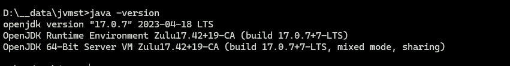

# JDK Version Manager (JVMS) for Windows

Manage multiple installations of JDK on a Windows computer.
[JVMS](https://github.com/ystyle/jvms), [Download Now](https://github.com/ystyle/jvms/releases)!

There are situations where the ability to switch between different versions of JDK can be very
useful. For example, if you want to test a project you're developing with the latest
bleeding edge version without uninstalling the stable version of JDK, this utility can help.

### Installation

- [Download Now](https://github.com/ystyle/jvms/releases)
- decompression zip and copy jvms.exe to a path what you want
- run cmd or powershell as administrator
- cd to folder where `jvms.exe` in
- run `jvms.exe init`
- Setup is complete ! Switch and install jdk see [Usage](#usage) Section


### Usage

```shell
NAME:
   jvms - JDK Version Manager (JVMS) for Windows

USAGE:
   jvms.exe [global options] command [command options] [arguments...]

VERSION:
   3.0.0

COMMANDS:
     init           Initialize config file
     config         Show config file
     list, ls       List current JDK installations.
     install, i     Install available remote jdk
     add, s         Install local JDK Symlink to store location.
     switch, s      Switch to use the specified version.
     remove, rm     Remove a specific version.
     origins, lso   Show a list of origins available for download url.
     versions, lsv  Show a list of versions available for download.
     proxy          Set a proxy to use for downloads.
     help, h        Shows a list of commands or help for one command

GLOBAL OPTIONS:
   --help, -h     show help
   --version, -v  print the version
```

how to install and switch jdk. see:

- run cmd or powershell as administrator
- `jvms lsv -a` *Show a list of versions available for download*


- `jvms install zulu17.42.19-ca-jdk17.0.7` *install zulu17.42.19-ca-jdk17.0.7*


- `jvms ls` *list installed jdk*


- `jvms switch zulu17.42.19-ca-jdk17.0.7` *switch jdk version to zulu17.42.19-ca-jdk17.0.7*


- `java -version` *restart terminal*



---

## What's the big difference?

First and foremost, this version of jvms has no dependency on other lib. It's written in [Go](http://golang.org/), which
is a much more structured
approach than hacking around a limited `.bat` file. It does not rely on having an existing jdk installation.

The control mechanism is also quite different. There are two general ways to support multiple jdk installations with hot
switching capabilities.
The first is to modify the system `PATH` any time you switch versions, or bypass it by using a `.bat` file to mimic the
jdk executable and redirect
accordingly. This always seemed a little hackish to me, and there are some quirks as a result of this implementation.

The second option is to use a symlink. This concept requires putting the symlink in the system `PATH`, then updating its
target to
the jdk installation directory you want to use. This is a straightforward approach, and seems to be what people
recommend.... until they
realize just how much of a pain symlinks are on Windows. This is why it hasn't happened before.

In order to create/modify a symlink, you must be running as an admin, and you must get around Windows UAC (that annoying
prompt). As a result, JVMS for Windows
maintains a single symlink that is put in the system `PATH` during `jvms init` only. Switching to different versions of
JDK is a matter of
switching the symlink target. As a result, this utility does **not** require you to run `jvms switch x.x.x` every time
you open a console window.
When you _do_ run `jvms switch x.x.x`, the active version of jdk is automatically updated across all open console
windows. It also persists
between system reboots, so you only need to use jvms when you want to make a change.

Overall, this project brings together some ideas, a few battle-hardened pieces of other modules, and support for newer
versions of JDK.

I also wrote a simple [data feed](http://github.com/ystyle/jvms) containing a list of jdk versions. It's free for anyone
to use.

## Create own local download server

### config download server

- create a json file. eg. `index.json`
- add you jdk download link to it. The format is like this:
  ```json
  [
    {
      "version":"1.9.0",
      "url":"http://192.168.1.101/files/jdk/1.9.0.zip"
    }
  ]
  ```
- copy this file to a static file server like nginx, apache etc.
- run `jvms init --original_path http://192.168.1.101/files/index.json` by the way, `jvms init --java_home` can modify
  default JAVA_HOME,  `jvms init --jvms_home` can modify work home.
- the run `jvms lsv` or `jvms install x` will list or install your jdk version

### create a jdk zip file

- open jdk_home folder
- compression all file to `*.zip` file
- copy zip file to your server
- add this zip file link to index.json

## License

MIT.
